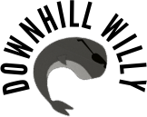

# Downhill Willy

You play as Willy the whale and the target is to race down the hill for as long as you can. Watch out for those logs, rocks, trees and snowmen in your way.

## Controls

- `Space` to start skiing
- `Up` and `Down` arrows to change the lane
- `F` to exit full screen

This 2D game was made by [Rasmus Nordling](https://github.com/happystinson) and [Michael Cassel](https://github.com/mcassel) during the [BOSS Jam 2014](https://boss.bthstudent.se/bossjam/bossjam-2014/). The theme was *inkorrekt val* which translates to incorrect whale or choice.

## Gameplay

## Credits

- Fonts used are [Sail](https://www.fontsquirrel.com/fonts/sail) and [League Gothic](https://www.fontsquirrel.com/fonts/League-Gothic)
- Ambient sound used is [pineforest winter NL SHORT 130110](https://freesound.org/people/klankbeeld/sounds/173841/) by [klankbeeld](https://freesound.org/people/klankbeeld/)
- Yodel loop used is sampled from [Franz "Franzl" Lang - Auf und auf voll Lebenslust](https://youtu.be/bXvoe7U1nwo?t=28)